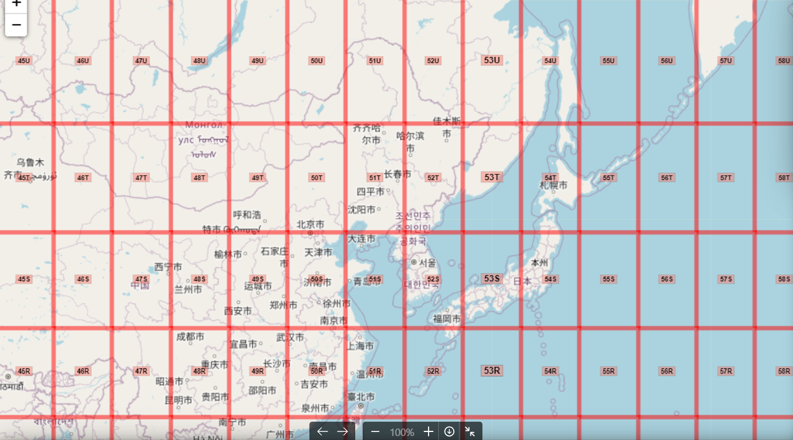
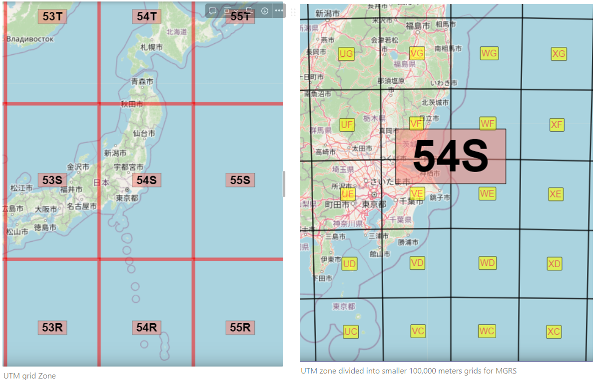

# Laz2Pcd

## Overview

This tool has 2 main objectives:
1. **converting files to pcd**: changing the format of the input file(s) from LAZ or LAS to PCD
    
    if the input is LAZ then: LAZ-->LAS-->PCD
    
    else if the input files are in LAS format: LAS-->PCD

2. **UTM/MGRS**: changing the points representation from longitude/latitude format to UTM/MGRS format

- input could be in eaither laz or las point cloud format (cuurent version works with laz files as input)
- the output is pcd format
- changing CoordinateReferenceSystem (CRS) of the original file is optional and can be done using this code


## How to use

### preperation - managing folders before running the cells
1. create a folder with the name <b>data</b> in your workspace root
2. create a folder with the name <b>original</b> in the data folder and put all the laz files that you need to convert in it


3. run the cells

### results - after running the cells
1. decompressed las files will be stored in a folder named <b>decompressed</b> in <b>./data/decommpressed</b>
2. pcd files will be stored in a folder named <b>PCD</b> in <b>./data/PCD</b>


## notes:
1. code will automatically scroll the whole content in the <b>original</b> folder and extracts the <b>.laz</b> files. so, make sure all the laz files in original folder are stored without any furthur sub-foldering.
2. the proccess is memory consuming depends on the size of the laz files. so, make sure your system has enough memory. 12GB available memory is enough for las files that each has maximum 10GB size.
3. There is a method in the code that shows some information of a pcd file (e.g. number of points, some points as sample). If you want to use this method you need open3d library and this library needs <b>python version 3.8</b>


## What is CRS

### Definition

CRS stands for Coordinate Reference System. It is a standardized way of defining and representing the positions of points on the Earth's surface. A CRS defines the coordinate system, map projection, and geodetic datum used to convert between geographic locations (latitude and longitude) and Cartesian (x, y, z) coordinates.

We need CRS to accurately represent and interpret spatial data. Different CRS are used for various purposes, and selecting the appropriate CRS is crucial for ensuring accurate spatial analysis, measurements, and map visualizations.

### Examples

There are numerous CRS used worldwide, but some of the most important and commonly used ones include:

1. WGS 84 (World Geodetic System 1984) - EPSG: 4326
    - Widely used for GPS and general global mapping applications.
2. UTM (Universal Transverse Mercator) - Several EPSG codes for different zones:
    - UTM Zone 10N (EPSG: 32610) - Used for parts of North America.
    - UTM Zone 33N (EPSG: 32633) - Used for parts of Europe.
    - UTM Zone 54N (EPSG: 32654) - Used for parts of Asia.
3. Web Mercator (WGS 84 / Pseudo-Mercator) - EPSG: 3857
    - Used by many web mapping services like Google Maps and OpenStreetMap.
4. NAD83 (North American Datum 1983) - EPSG: 4269
    - Commonly used for mapping in North America.
5. JGD2000 (Japanese Geodetic Datum 2000) - EPSG: 4612
    - Used for mapping in Japan.
6. ETRS89 (European Terrestrial Reference System 1989) - EPSG: 4258
    - Used for mapping in Europe.
7. GDA94 (Geocentric Datum of Australia 1994) - EPSG: 4283
    - Used for mapping in Australia.
8. Pulkovo 1942 (EPSG: 4284) and Pulkovo 1995 (EPSG: 4200)
    - Used for mapping in Russia and former Soviet Union countries.

### EPSG codes

EPSG (European Petroleum Survey Group) codes are unique identifiers used to define Coordinate Reference Systems (CRSs) and geodetic parameters. Each EPSG code corresponds to a specific geospatial coordinate system or datum, which allows geospatial data to be consistently referenced across different applications and systems. Here are some important and commonly used EPSG codes:

1. **EPSG:3095** (JGD2011 / UTM zone 54N):
    - Description: EPSG:3095 represents the Universal Transverse Mercator (UTM) projection for zone 54N in Japan, based on the Japan Geodetic Datum 2011 (JGD2011).
    - Usage: This coordinate reference system is commonly used for local mapping and surveying in the northern part of Japan (Hokkaido and surrounding regions), as UTM zone 54N covers that area.
2. **EPSG:3094** (JGD2011 / Japan Plane Rectangular CS I):
    - Description: EPSG:3094 represents the Japan Plane Rectangular Coordinate System I based on the Japan Geodetic Datum 2011 (JGD2011).
    - Usage: This coordinate reference system is used for mapping and surveying in Japan, providing accurate coordinates in meters within the first zone of the Japan Plane Rectangular Coordinate System. The other zones are represented by different EPSG codes, such as EPSG:3096 for Zone II.
    
    **UTM Zones**:
    
    - EPSG: 326xx (e.g., EPSG: 32633, EPSG: 32634, EPSG: 32635, ...)
    - Description: Universal Transverse Mercator (UTM) is a widely used system for representing locations on the Earth's surface, especially for large-scale maps and local surveys.

Online Tool to find EPSG code: https://epsg.io/

## What is UTM & MGRS

### UTM

The **Universal Transverse Mercator (UTM)** system is a global map projection used to represent the Earth's surface on a two-dimensional plane. It divides the Earth into a series of zones, each with its own local coordinate system, allowing accurate mapping of both small and large areas.


UTM grid zones of the earth



UTM grid zones of some part of Asia including Japan

Key characteristics of the UTM system:

1. **Zones**: The Earth's surface is divided into 60 zones, each 6 degrees of longitude wide. These zones are numbered sequentially from 1 to 60, starting at the international date line in the Pacific Ocean.
2. **Transverse Mercator Projection**: UTM uses the **Transverse Mercator projection**, which is a cylindrical map projection that provides minimal distortion of shape, angle, and area within each UTM zone.
3. **Local Coordinates**: Each UTM zone has its own coordinate system. The X-axis (easting) measures distances eastward from a central meridian within the zone, while the Y-axis (northing) measures distances northward from the equator. The origin of the coordinate system is set at the equator and a specific longitude within each zone.
4. **False Easting and Northing**: To ensure that all coordinates are positive values, a "false easting" and "false northing" value is added to each point's easting and northing values. This ensures that no coordinates are negative within the zone.
5. **Zone Identification**: UTM zones are identified by a number and a hemisphere letter. The hemisphere letter is either "N" for the northern hemisphere or "S" for the southern hemisphere.
6. **Units**: Distances within the UTM coordinate system are usually expressed in meters.

UTM is widely used for large-scale mapping, navigation, and geographical information systems (GIS) applications. It provides a compromise between conformality, equal area, and distance accuracy, making it suitable for various mapping needs. However, UTM is most accurate within its specific zone, and distortion increases as you move away from the central meridian of that zone. To minimize distortion, UTM is not typically used for mapping areas that span multiple UTM zones.

### MGRS

The MGRS (Military Grid Reference System) is a geocoordinate system used by the military to specify locations on the Earth's surface. It provides a precise way to identify points on a map or in the field. The system is based on the Universal Transverse Mercator (UTM) grid system and extends it by adding a lettered grid square identification.

<aside>
💡 MGRS is not a coordinate reference system (CRS) in itself, but rather a grid-based system used for identifying locations on the Earth's surface. It is based on the Universal Transverse Mercator (UTM) projection and uses a grid of squares to divide the Earth's surface into regions.

</aside>

### How to use and how to read

The MGRS is divided into several components:

1. Grid Zone Designation: The Earth is divided into 60 grid zones, each spanning 6 degrees of longitude. These zones are designated by letters from C to X (excluding I and O) to cover the entire globe.

    
3. 100,000-Meter Square Identifier: Each grid zone is further divided into 100,000-meter squares, identified by a two-letter combination. The combinations range from AA to ZZ, excluding a few combinations that could be confused with alphanumeric coordinates.
4. Easting: The easting represents the east-west position within the 100,000-meter square. It is a six-digit number that indicates the distance in meters from the left edge of the square.
5. Northing: The northing represents the north-south position within the 100,000-meter square. It is also a six-digit number indicating the distance in meters from the bottom edge of the square.
6. Additional Precision: For even greater precision, the 100,000-meter square can be further divided into smaller grids of 10,000, 1,000, 100, 10, or 1 meter. These subdivisions are indicated by additional digits in the easting and northing values.

To form a complete MGRS coordinate, you would combine all these components. For example, a location in Afghanistan might have the MGRS coordinate 42S XD 12345 67890, where "42S" represents the grid zone, "XD" represents the 100,000-meter square, and "12345" and "67890" represent the easting and northing, respectively.

The MGRS system is widely used by military personnel for navigation, target identification, and communication of precise locations. It allows for accurate and standardized referencing of geographic positions on maps and in the field, facilitating coordination and situational awareness among military units.

<aside>
💡 An MGRS grid reference is a point reference system. When the term 'grid square' is used, it can refer to a square with a side length of 10 km, 1 km, 100 m, 10 m or 1 m, depending on the precision of the coordinates provided. The number of digits in the numerical location must be even: 0, 2, 4, 6, 8 or 10, depending on the desired precision.

</aside>

### example

- 4Q ......................GZD only, precision level 6° × 8° (in most cases)
- 4Q FJ ...................GZD and 100 km Grid Square ID, precision level 100 km
- 4Q FJ 1 6 ...............precision level 10 km
- 4Q FJ 12 67 .............precision level 1 km
- 4Q FJ 123 678 ...........precision level 100 m
- 4Q FJ 1234 6789 .........precision level 10 m
- 4Q FJ 12345 67890 .......precision level 1 m

### MGRS and UTM relation

MGRS (Military Grid Reference System) and UTM (Universal Transverse Mercator) are two different but related coordinate systems used for specifying locations on the Earth's surface.

UTM is a global coordinate system that divides the Earth into 6-degree longitudinal zones, each of which is projected using the Transverse Mercator projection. The UTM system provides a 2-dimensional Cartesian coordinate representation of locations within each zone, and it is commonly used for large-scale mapping and navigation. 

In summary, UTM is a global coordinate system that provides a general location within a 6-degree longitudinal zone, while MGRS provides a more detailed grid reference within each UTM zone. MGRS divides each UTM zone into smaller grids using a alphanumeric code. The grid reference consists of a UTM zone designator, a 100,000-meter square identifier, and an easting and northing value within that square. MGRS is based on UTM, and the two systems are closely related.

### example

```python
Latitude Longitude
35.889845, 139.954435
UTM
54S 405633 3972236
MGRS
54S VE 05633 72235
```



UTM grid Zone - UTM zone divided into smaller 100,000 meters grids for MGRS

### Online tools for MGRS and UTM

[MGRS Mapper (Free Version) | Operational Graphics Tool for Junior Military Leaders](https://mgrs-mapper.com/app)

## convert LatLong to UTM and MGRS

https://coordinates-converter.com/en/decimal/51.000000,10.000000?karte=OpenStreetMap&zoom=8

## Transporting from one CRS to another

## python libraries

### 1. pyproj

[pyproj](https://pypi.org/project/pyproj/)

[pyproj 3.6.0 documentation](https://pyproj4.github.io/pyproj/stable/)

```python
import pyproj
"""
EPSG:6668: LL-JGD2011-ITRF08, longlat.
    Name:	JGD2011
    Datum:	Japanese_Geodetic_Datum_2011
    Type:	Geographic
EPSG:6677: MGRS, X,Y
    Name:	JGD2011 / Japan Plane Rectangular CS IX
    Datum:	Japanese_Geodetic_Datum_2011
    Type:	Projected
EPSG:32654: WGS 84
    Name:	WGS 84 / UTM zone 54N
    Datum:	WGS_1984
    Type:	Projected
"""
src_crs = pyproj.CRS.from_epsg(current_CRS_EPSG) #example: 6668
tgt_crs = pyproj.CRS.from_epsg(target_CRS_EPSG) #example: 32654
transformer = pyproj.Transformer.from_crs(src_crs, tgt_crs, always_xy=True)

# Transform long lat to X Y
transformed_points = transformer.transform(latitude, longitude, altitude)
```

### 2. pygeodesy

[PyGeodesy](https://mrjean1.github.io/PyGeodesy/)

[PyGeodesy](https://pypi.org/project/PyGeodesy/)

```python
# example of converting long lat values to UTM and MGRS using pygeodesy
from pygeodesy import Epsg, epsg, toUtmUps8, Utm
latitude =  35.889845
longitude = 139.954435
utm = toUtmUps8(latitude, longitude)
print(utm)
mgrs = utm.toMgrs()
print(mgrs)
54 N 405633 3972236
54S VE 05633 72235
```

### 3. utm

<aside>
💡 This library is better than pygeodesy timewise

</aside>

[utm](https://pypi.org/project/utm/)

```python
# example of converting longitude and latitude to UTM using utm library
!pip install utm
from utm import from_latlon
latitude =  35.889845
longitude = 139.954435
converted_utm = from_latlon(latitude, longitude)
print(converted_utm)
(405633.221574467, 3972235.559399459, 54, 'S')
```
