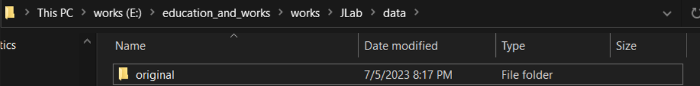
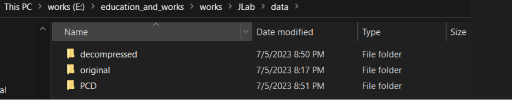

# Laz2Pcd

## Overview

This tool has 2 main objectives:
1. **converting files to pcd**: changing the format of the input file(s) from LAZ or LAS to PCD
    
    if the input is LAZ then: LAZ-->LAS-->PCD
    
    else if the input files are in LAS format: LAS-->PCD

2. **UTM/MGRS**: changing the points representation from longitude/latitude format to UTM/MGRS format

- input could be in eaither laz or las point cloud format (cuurent version works with laz files as input)
- the output is pcd format
- changing CoordinateReferenceSystem (CRS) of the original file is optional and can be done using this code

## How to use

### preperation - managing folders before running the cells
1. create a folder with the name <b>data</b> in your workspace root
2. create a folder with the name <b>original</b> in the data folder and put all the laz files that you need to convert in it

3. run the cells

### results - after running the cells
1. decompressed las files will be stored in a folder named <b>decompressed</b> in <b>./data/decommpressed</b>
2. pcd files will be stored in a folder named <b>PCD</b> in <b>./data/PCD</b>

## notes:
1. code will automatically scroll the whole content in the <b>original</b> folder and extracts the <b>.laz</b> files. so, make sure all the laz files in original folder are stored without any sub-foldering like below
2. the proccess is memory consuming depends on the size of the laz files. so, make sure your system has enough memory. 12GB available memory is enough for las files that each has maximum 10GB size.

